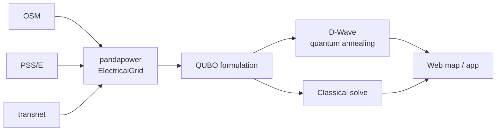

# QPGrid

Electrical grids run on optimization math that predates the renewable, distributed, bidirectional grid it now has to manage. QPGrid is a testbed for the opposite bet: take real grid topology, formulate its hardest problems as QUBO/Ising instances, and see how much of it a quantum annealer can actually solve better.

No hackathon, no team, no deadline — see [Origin](#origin). Just the research.

## What this is

A pipeline: real open-source grid data → `pandapower` network → optimization (classical *and* quantum) → an interface that makes the result legible to someone who isn't a power-systems engineer. Two problem classes anchor it:

- **Microgrid formation** — partition a grid into self-sufficient sub-networks. QUBO-formulated, solved via D-Wave quantum annealing. Designed and mostly implemented.
- **Optimal power flow (ACOPF)** — the open question: *can a quantum computer find better ACOPF solutions than classical interior-point methods, and where's the actual advantage?* Not yet started. This is the interesting one.

Full framing: [docs/00-VISION.md](docs/00-VISION.md).

## Architecture



Three data-format converters feed one graph representation; one formulation, two solvers; one surface for the result. Detail: [docs/01-ARCHITECTURE.md](docs/01-ARCHITECTURE.md) · algorithm survey: [docs/02-ALGORITHMS.md](docs/02-ALGORITHMS.md) · literature: [docs/03-LITERATURE.md](docs/03-LITERATURE.md) · data sources: [docs/04-DATA-SOURCES.md](docs/04-DATA-SOURCES.md).

## State of the code

Honest snapshot, not a sales pitch — full detail in [docs/versions/V0_SUMMARY.md](docs/versions/V0_SUMMARY.md):

- **Works today**: `transnet` → `pandapower` conversion, end to end. PSS/E and OSM converters parse real data but stop short of building the network.
- **Designed, currently broken**: the microgrid QUBO math (modularity + self-reliance objective, derived in `docs/../notebooks/microgrids.ipynb`, implemented in `pp_to_microgrid.py`) doesn't run — `pp_to_microgrid.py` has a syntax error blocking everything downstream of it. That's the first fix, and it's small.
- **Scaffold, not product yet**: the mobile app and web map are real UI with one real feature (an embedded interactive grid map) — optimization tools aren't wired to either yet.

This is a snapshot, not a complaint — a broken syntax error and two `NotImplementedError` stubs between here and a working quantum-vs-classical ACOPF comparison is a good place to be starting from.

## Quickstart

```sh
conda env create -f environment.yml --solver=libmamba   # classic solver takes >20 min on this dep set
conda activate qpgrid
```

Python 3.12 (highest that satisfies both Classiq ≤3.13 and gridfm-datakit <3.13). `pandapower` is pip-installed from `environment.yml`'s `pip:` section — conda-forge stops at 3.2.1, the converters target the 3.5 line. D-Wave Ocean SDK 9.x included; a D-Wave Leap account/API token is only needed for real QPU access — `SimulatedAnnealingSampler` (`dimod`) works with no account for local dev.

External datasets/tools from [docs/07-TOOLING-UPDATES.md](docs/07-TOOLING-UPDATES.md) each have a Python hook (`data/*_to_pp.py`, `pypsa_bridge.py`) — see [docs/08-TOOLING-INTEGRATION.md](docs/08-TOOLING-INTEGRATION.md); [notebooks/tooling_integration.ipynb](notebooks/tooling_integration.ipynb) runs all of them against bundled offline fixtures and [web/tooling_dashboard.html](web/tooling_dashboard.html) shows the status + a converted network on an OpenInfraMap basemap.

**Plotly for plotting** — charts via `plotly.graph_objects`, grid networks via `pandapower.plotting.plotly`.

Mobile app (separate Node project, not part of the conda env):

```sh
cd QPGrid && npm install && npx expo start
```

## Docs

| Doc | Covers |
|---|---|
| [docs/00-VISION.md](docs/00-VISION.md) | Why this exists, the four pillars, the core research question |
| [docs/01-ARCHITECTURE.md](docs/01-ARCHITECTURE.md) | Data → graph → optimize → map/app, layer by layer |
| [docs/02-ALGORITHMS.md](docs/02-ALGORITHMS.md) | Problem survey — what's formulated, what tool fits each |
| [docs/03-LITERATURE.md](docs/03-LITERATURE.md) | ~20 papers, one-line takeaway each, organized by topic |
| [docs/04-DATA-SOURCES.md](docs/04-DATA-SOURCES.md) | Grid datasets + mapping APIs, catalogued (through mid-2024) |
| [docs/05-QUANTUM-UPDATES.md](docs/05-QUANTUM-UPDATES.md) | Quantum-for-grid research since mid-2024 — papers, hardware, honest advantage-claim scorecard |
| [docs/06-ML-SOTA.md](docs/06-ML-SOTA.md) | Classical ML/GNN SOTA for power flow — the bar quantum has to beat |
| [docs/07-TOOLING-UPDATES.md](docs/07-TOOLING-UPDATES.md) | Data/tooling updates since mid-2024 — HIFLD Open is dead, read this |
| [docs/08-TOOLING-INTEGRATION.md](docs/08-TOOLING-INTEGRATION.md) | 07's survey turned into code — one Python hook per tool, adopt/reject decisions, verification |
| [docs/versions/V0_SUMMARY.md](docs/versions/V0_SUMMARY.md) | Ground-truth repo state, file by file, priority-ordered punch list |
| [CLAUDE.md](CLAUDE.md) / [AGENTS.md](AGENTS.md) | Agent entry point — read before any AI-assisted work here |

## Origin

Started as a Womanium Quantum+AI 2024 hackathon project — original submission archived at [womanium_README.md](womanium_README.md). The program's over, the judging rubric doesn't matter anymore, and neither does the deadline. What's left is the actual research question, now with no clock on it.

---

*Related: [[CLAUDE]] · [[docs/00-VISION]] · [[docs/versions/V0_SUMMARY]] · [[physics/README]]*
